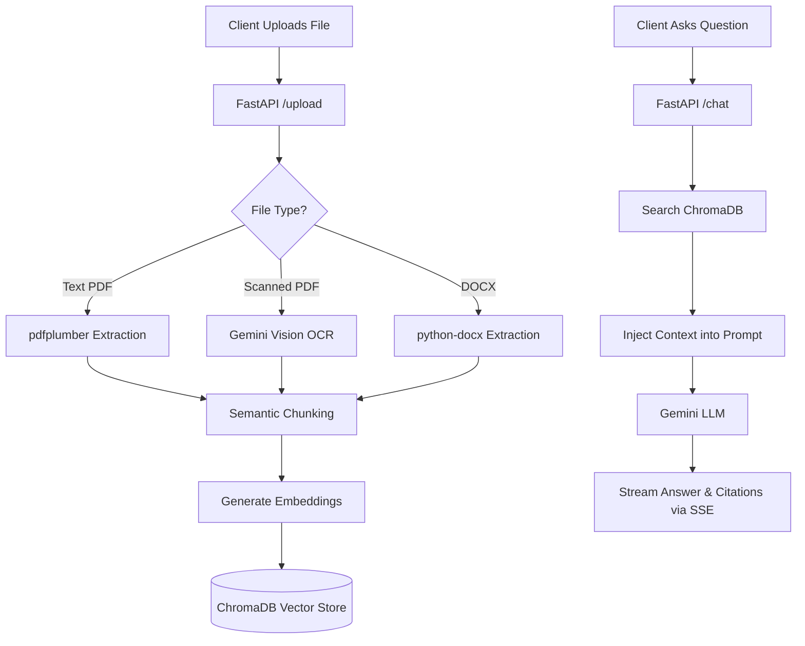

# Document AI Assistant - Backend

## Overview
This is the backend service for the Document AI Assistant. It is a production-ready Retrieval-Augmented Generation (RAG) system that processes user documents, performs semantic chunking, and provides an intelligent conversational interface using Google Gemini.

## Technology Stack
- **Framework**: FastAPI (Python)
- **Vector Database**: ChromaDB (for fast semantic search)
- **AI Models**: Google Gemini 2.0 Flash (LLM & Vision OCR), Gemini Text Embedding
- **Data Streaming**: Server-Sent Events (SSE) for real-time progress
- **Document Parsers**: `pdfplumber` (PDFs), `pypdfium2` (Image/Scanned PDFs), `python-docx` (Word files)

## System Architecture



## How the Process Works
1. **Document Ingestion**: When a user uploads a file, the system determines the optimal parsing strategy. If it detects a scanned document or image, it automatically applies Optical Character Recognition (OCR) to accurately extract the layout and text.
2. **Semantic Chunking**: The extracted text is divided into coherent paragraphs (bounded to 800 characters) rather than arbitrary slices. This ensures that the system retains the precise meaning of each sentence.
3. **Vector Storage**: Each semantic chunk is converted into a mathematical vector (embedding) and stored in ChromaDB.
4. **Intelligent Retrieval**: When a question is asked, the system retrieves the most relevant chunks. It strictly instructs the AI to only utilize these specific paragraphs, effectively mitigating hallucinations and ensuring exact source citations.

## API Endpoints
The backend exposes three primary REST endpoints:
1. `GET /health` : Verifies server status. It is also used by the internal Keep-Alive thread to prevent the server from spinning down on platforms like Render.
2. `POST /upload` : Accepts multipart document files (PDF, DOCX, TXT). It streams real-time parsing and embedding progress back to the client using Server-Sent Events (SSE).
3. `POST /chat` : Accepts user queries. It streams the AI's response token-by-token and concludes by sending the exact source paragraphs (citations) utilized.

## Environment Configuration
Create a `.env` file in the root directory:
```ini
# Required: Google Gemini API Key
GEMINI_API_KEY="your-api-key-here"

# Required: Allowed CORS Origins (e.g., Vercel URL or localhost)
ALLOWED_ORIGINS="http://localhost:3000,https://your-frontend-url.vercel.app"

# Optional: Advanced Database Configurations
GROQ_API_KEY=""
CHROMA_TENANT=""
CHROMA_DATABASE=""

# Server Port
PORT=8000
```

## Running the Server
Ensure you are using Python 3.11+.
```bash
pip install -r requirements.txt
uvicorn app.main:app --reload --port 8000
```
