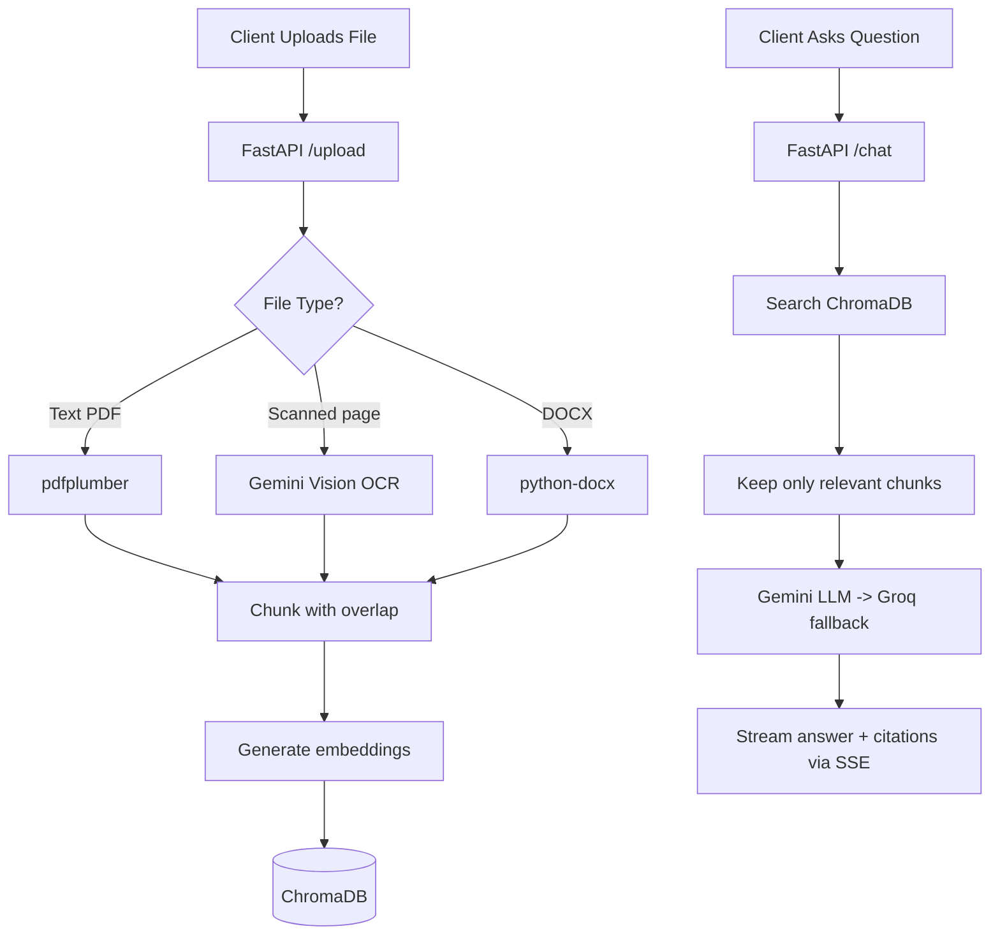

# Document AI Assistant — Backend

## Overview
A Retrieval-Augmented Generation (RAG) backend. It takes a user's document, splits it into small pieces, turns those pieces into vectors, and stores them. When the user asks a question, it finds the most relevant pieces and asks an LLM to answer using only those pieces — so answers stay grounded in the document and come with citations.

## Technology Stack
- **Framework**: FastAPI (Python 3.11)
- **Vector Database**: ChromaDB (Chroma Cloud in production; in-memory fallback locally)
- **LLM**: Google Gemini 2.5 Flash, with **Groq (Llama 3.3 70B) as an automatic fallback**
- **Embeddings**: Google `gemini-embedding-001`
- **OCR**: Gemini 2.5 Flash Vision (for scanned / image-only pages)
- **Document parsing**: `pdfplumber` (text PDFs), `pypdfium2` (renders pages for OCR), `python-docx` (Word)
- **File type detection**: `filetype` (pure-Python magic bytes — no system libraries needed)
- **Streaming**: Server-Sent Events (SSE) for live progress and token-by-token answers
- **Resilience**: `tenacity` for retries with backoff; `slowapi` for rate limiting

## System Architecture



## How Chunking Works
Long text can't be searched or fed to an LLM all at once, so we split it into small, overlapping pieces:

1. **Split smartly, not blindly.** The splitter tries natural boundaries in order — paragraphs (`\n\n`), then lines (`\n`), then sentences (`. `), then words. This keeps related sentences together instead of cutting mid-thought.
2. **Bounded size.** Each chunk is capped at ~800 characters, small enough to be a precise search hit.
3. **Overlap between chunks (~150 characters).** Each new chunk starts by repeating the tail of the previous one. This matters: if a fact sits right on a boundary (e.g. a number and its label split across two chunks), the overlap keeps it whole in at least one chunk, so retrieval doesn't miss it.
4. Each chunk is stored with its `document_id`, filename, and page number so we can cite it later.

## How Retrieval Works
When a question comes in:

1. The question is turned into a vector using the same embedding model (with `task_type=RETRIEVAL_QUERY`, which is tuned for search queries).
2. We fetch the **8 closest chunks** from ChromaDB, filtered to the user's documents only.
3. We then **keep only the clearly-relevant ones**: always the top 3, plus any others close in distance to the best match, capped at 6. This trims weak, off-topic chunks so we don't feed the LLM noise (which is what causes wrong answers and bad citations). The filter is relative to the best match, so it never accidentally drops the strongest result.
4. The kept chunks are put into the prompt as numbered sources `[1] [2] ...`, and the LLM is told to answer **only** from them, cite inline, and say "I don't have enough information" if the answer isn't there.
5. The answer streams back token-by-token, followed by the citation list (chunk IDs + page numbers).

## Fallback & Reliability Mechanisms
The system is built to degrade gracefully instead of failing outright:

- **LLM fallback (Gemini → Groq).** Gemini is the primary model. If it fails *before sending any text* (e.g. it's down or over quota), we automatically switch to Groq's Llama 3.3 and answer from there. If Gemini fails *mid-stream* (after some text was already sent), we do **not** re-run Groq — that would duplicate the answer — we stop and show a clear error instead.
- **OCR fallback for scanned documents.** For PDFs, we first try normal text extraction. If a page has almost no text, it's likely scanned or an image, so we render it and run Gemini Vision OCR on it. For DOCX files with no text, we OCR any embedded images.
- **Vector DB fallback.** If Chroma Cloud credentials aren't set, the app falls back to an in-memory store so it still runs locally (note: in-memory data does not persist).
- **Automatic retries.** Embedding and database calls are wrapped in a retry with exponential backoff (3 attempts). Short-lived problems (timeouts, 5xx, brief rate limits) recover on their own; genuine bad requests fail fast.
- **Friendly error messages.** Raw errors are translated for the user. Out-of-credits / rate-limit errors become "The AI service is out of credits, please try again later"; unreadable image-only files become a "try a clearer or text-based document" message.
- **Suggested-questions fallback.** The starter questions are generated from the document, but if that generation fails, four sensible default questions are used instead.
- **Empty-context handling.** If retrieval finds nothing relevant, the LLM is told to politely say so rather than invent an answer.
- **Keep-alive.** A background thread pings `/health` every 10 minutes so the free Render instance doesn't spin down between requests.

## Performance Notes
- All blocking work (embeddings, database, OCR, LLM streaming) runs in a worker thread pool, so one user's request never freezes the server for everyone else.
- SDK clients (Gemini, Groq, Chroma) are created once and reused (guarded by a reentrant lock), avoiding per-request setup latency.
- Network calls have 60-second timeouts, and the vector-database write has its own 90-second guard, so a hung upstream can't freeze a request forever — the user gets a clear error instead.
- We pass our own Gemini embeddings to Chroma and disable its built-in embedding model (`embedding_function=None`). This avoids an ~80MB model download on first use, which otherwise stalls on hosts with a cold or ephemeral filesystem (e.g. Render's free tier).

## API Endpoints
1. `GET /health` — server status; also used by the keep-alive thread.
2. `POST /upload` — accepts a PDF, DOCX, or TXT file (max 10 MB) and streams parsing + embedding progress over SSE.
3. `POST /chat` — accepts a question, streams the answer, then sends the source citations.
4. `POST /chat/suggestions` — returns 4 document-aware starter questions.

## Environment Configuration
Create a `.env` file:
```ini
# Required: Google Gemini API key (LLM, embeddings, OCR)
GEMINI_API_KEY="your-gemini-key"

# Required: allowed CORS origins (your frontend URL(s), comma-separated)
ALLOWED_ORIGINS="http://localhost:3000,https://your-frontend.vercel.app"

# Recommended: Groq API key — enables the automatic LLM fallback
GROQ_API_KEY="your-groq-key"

# Vector database (Chroma Cloud). If omitted, an in-memory store is used.
CHROMA_API_KEY="your-chroma-key"
CHROMA_TENANT="your-tenant-id"
CHROMA_DATABASE="your-database-name"

PORT=8000
```

## Running the Server
Requires Python 3.11+.
```bash
pip install -r requirements.txt
uvicorn app.main:app --reload --port 8000
```
